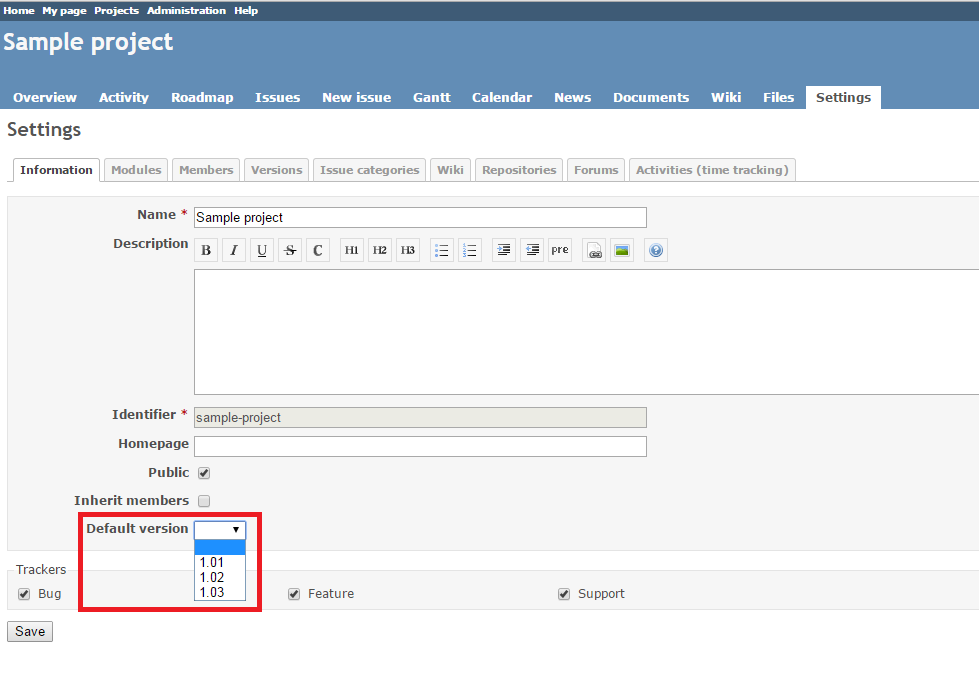
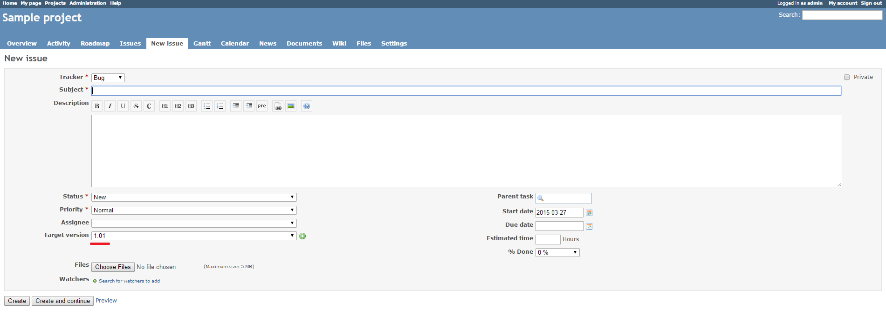

# Redmine Default Version Plugin

This plugin enables you to specify a default version for a Redmine project.

The initial authors are [Tony Marschall](https://github.com/tonymarschall/redmine_default_version) and [benasher44](https://github.com/benasher44/redmine_default_version).

## Compatibility

This plugin version is compatible only with Redmine 2.1 and later.

## Installation

1. To install the plugin
    * Download the .ZIP archive, extract files and copy the plugin directory into #{REDMINE_ROOT}/plugins.
    
    Or

    * Change you current directory to your Redmine root directory:  

            cd {REDMINE_ROOT}
            
      Copy the plugin from GitHub using the following commands:
      
            git clone https://github.com/Undev/redmine_default_version.git plugins/redmine_default_version
            
2. This plugin requires a migration. Run the following command to upgrade your database (make a database backup before):  

        bundle exec rake redmine:plugins:migrate RAILS_ENV=production
            
3. Restart Redmine.

Now you should be able to see the plugin in **Administration > Plugins**.

## Usage	

If there are any project versions specified, the plugin adds the **Default version** field to the **Information** tab of the project settings.  

After you set a project version as default, this version will be automatically specified as the target version when you create a new issue for this project.  

## License

Copyright (c) 2015 Undev

Licensed under the Apache License, Version 2.0 (the "License");
you may not use this file except in compliance with the License.
You may obtain a copy of the License at

http://www.apache.org/licenses/LICENSE-2.0

Unless required by applicable law or agreed to in writing, software
distributed under the License is distributed on an "AS IS" BASIS,
WITHOUT WARRANTIES OR CONDITIONS OF ANY KIND, either express or implied.
See the License for the specific language governing permissions and
limitations under the License.